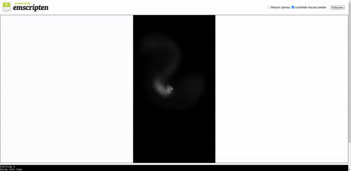

# Fluid Simulation on the browser

This is a simple fluid simulation implementation. The main idea is to use a grid to simulate fluid attributes, such as density and velocity. Then the fluid can be updated using algorithms based on the Navier-Stokes equations.

## [Demo](https://luc16.github.io)

The [Demo](https://luc16.github.io) can be accessed and played with, to generate
fluid drag the mouse (or finger if on touch screen) to generate
smoke-like fluid.

    

## References

The ideas and algorithm used in this simulation were based on these papers:

- **Stable Fluids** by Jos Stam
   https://pages.cs.wisc.edu/~chaol/data/cs777/stam-stable_fluids.pdf
- **Real-Time Fluid Dynamics for Games** by Jos Stam
    http://graphics.cs.cmu.edu/nsp/course/15-464/Fall09/papers/StamFluidforGames.pdf

## License
This project is distributed under the [MIT license](../../LICENSE.md).